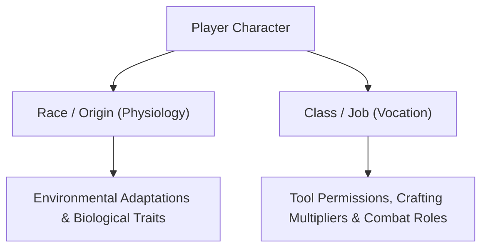

# Origins Rustic (Rustic Craft 2 — Minecraft 1.21.1)

Welcome to **Origins Rustic**, the core RPG and survival economy datapack for the **Rustic Craft 2 (`RC2`)** modpack running on Minecraft 1.21.1 (`pack_format: 48`).

---

## Overview

Origins Rustic delivers a deeply immersive medieval-fantasy survival experience centered on **biological identity** (12 Races/Origins) and **vocational expertise** (13+ Classes/Jobs). 

Players choose their innate race to dictate environmental adaptations, physical attributes, and dietary needs, while choosing a profession to unlock tool permissions, crafting yield bonuses, and specialized party mechanics.



---

## Documentation Suite (`docs/`)

Per the repository specification standards, all technical, architectural, and design documentation is maintained inside the [`docs/`](file:///e:/Github2/origins-rustic/docs/) directory:

| Specification Document | Purpose & Scope |
| :--- | :--- |
| [`Business.md`](file:///e:/Github2/origins-rustic/docs/Business.md) | High-level gameplay design, economic loops, player roles, combat meta, and non-goals. |
| [`Decision.md`](file:///e:/Github2/origins-rustic/docs/Decision.md) | Architecture Decision Records (ADR-001 through ADR-006) documenting durable choices. |
| [`Milestones.md`](file:///e:/Github2/origins-rustic/docs/Milestones.md) | Milestone outcome gates, roadmap checkpoints, and GitHub issue mapping (#1 through #14). |
| [`Collaboration.md`](file:///e:/Github2/origins-rustic/docs/Collaboration.md) | Contribution standards, branch lifecycle (`master` <- `v2.0` <- `feature/*`), PR contract, and quality checklist. |
| [`RUSTIC_ORIGINS_SPEC.md`](file:///e:/Github2/origins-rustic/docs/RUSTIC_ORIGINS_SPEC.md) | Exhaustive technical specification of all 12 Races and 13+ Classes with full attribute math and tag paths. |
| [`docs/README.md`](file:///e:/Github2/origins-rustic/docs/README.md) | Internal documentation directory index. |

---

## Repository & Datapack Structure

```
origins-rustic/
├── README.md                               # Root entrypoint & overview
├── pack.mcmeta                             # Minecraft 1.21.1 datapack metadata (pack_format: 48)
├── docs/                                   # Specification & Architecture Suite
│   ├── README.md
│   ├── Business.md
│   ├── Decision.md
│   ├── Milestones.md
│   ├── Collaboration.md
│   └── RUSTIC_ORIGINS_SPEC.md
└── data/
    ├── origins/tags/origins/origin/        # 12 Playable Races registration
    ├── origins_classes/                    # Classes tag registration & recipe modifiers
    └── rustic/
        ├── item_modifier/                  # Blacksmith weapon/armor upgrade modifiers
        ├── loot_table/                     # Ore doubling, farmer wheat, fishing loot
        ├── origins/origin/                 # Race & class definition files
        ├── origins/power/                  # Individual power & ability JSONs
        └── tags/
            ├── block/                      # 1.21 singular block tags (stone, crops_all)
            ├── item/                       # 1.21 singular item tags (weapons, armor, tools)
            └── origins/power/              # Grouping tags for origins and classes
```

---

## Installation & Setup

### Singleplayer
1. Download the repository as a `.zip` or clone directly.
2. Place the folder or `.zip` into your world's `datapacks/` directory:
   `saves/<WorldName>/datapacks/origins-rustic`
3. Launch Minecraft 1.21.1 with Fabric Loader and required dependencies:
   * **Origins (Fabric)**
   * **Origins: Classes**
   * **Pehkui**
   * **Apoli**
4. Run `/reload` in-game.

### Dedicated Server
1. Place the `origins-rustic` folder inside `world/datapacks/`.
2. Ensure compatible server-side mods are present in `mods/`.
3. Restart or run `reload` in server console. Verify clean startup without missing tag warnings.

---

## Development & Branching Rules

We operate strictly under the release integration model:
* **`master` is protected**: Never commit directly to `master`.
* **`v2.0` is active release branch**: All feature branches branch off `v2.0` and merge back into `v2.0`.
* **Feature Branches**: Isolated branches (`feature/*`, `fix/*`, `docs/*`) are used for each component.
* **Team Approval**: Promotion from `v2.0` to `master` occurs exclusively via peer-reviewed Pull Request.
