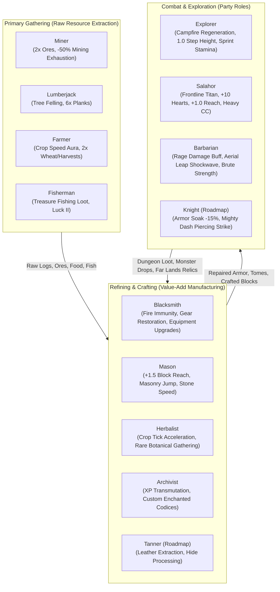
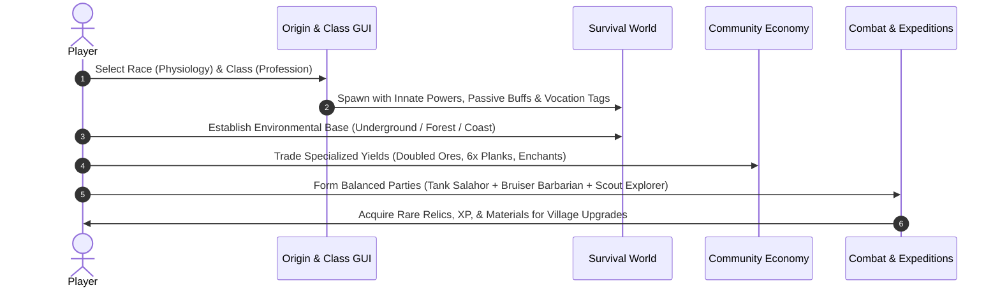

# Origins Rustic — Gameplay Design, Server Meta & Economy (`Business.md`)

This specification defines the gameplay design, economic architecture, player progression, and roleplay mechanics of **Origins Rustic** within the **Rustic Craft 2 (`RC2`)** modpack for Minecraft 1.21.1 (`pack_format: 48`).

---

## 1. Problem Statement & Motivation

In standard vanilla Minecraft, a single player becomes entirely self-sufficient within hours—capable of mining, farming, enchanting, smithing, and conquering all dimensions without ever interacting with another player. In a multiplayer roleplay-centric survival server, this rapid independence dissolves community interaction, collapses player trading, and trivializes survival challenges.

**Origins Rustic** solves this problem by establishing **interdependent biological identities** (Races/Origins) and **vocational specializations** (Classes/Jobs). Players are incentivized to collaborate, specialize, trade goods, and form balanced adventuring parties.

---

## 2. Beneficiaries & Target Actors

| Actor | Description & Needs |
| :--- | :--- |
| **Survival Roleplayer** | Desires thematic immersion, distinct racial traits, environmental adaptations, and meaningful strengths/weaknesses. |
| **Trade Craftsman** | Desires an economy where specialized professions (Blacksmith, Farmer, Tanner, Mason, Archivist) create exclusive value. |
| **Combat / Dungeon Delver** | Needs specialized combat archetypes (Tank, Bruiser, Skirmisher, Scout) with distinct tactical roles in party combat. |
| **Server Administrator** | Requires stable datapack performance on Minecraft 1.21.1, zero crash loops, clean tag registries, and configurable drop hooks. |

---

## 3. Core Design Pillars

1. **Dual-Layer Identity**:
   * **Race (Origin)**: Represents innate biology, physiological constants, metabolic needs, and environmental vulnerabilities. Immutable under normal survival.
   * **Class (Job)**: Represents training, trade expertise, and societal vocation. Governs tool permissions, refining efficiency, and craft yields.
2. **Economic Interdependence Without Hard Deadlocks**:
   * No single player can excel in every trade. Tool restrictions (e.g. Butcher cleavers, Farmer watering cans) ensure that specialized professions remain vital to the community.
   * Universal vanilla crafting recipes remain functional, ensuring solo players can survive, but specialized classes operate with 2x–3x efficiency and exclusive high-tier outputs.
3. **Biophilic Adaptation & Ecosystem Niches**:
   * Every origin commands a territorial home where they thrive, balanced by hostile biomes where they suffer:
     * *Amphibians*: Masters of oceans and rivers; weakened on arid terrain.
     * *Dwarves*: Masters of subterranean mining ($Y \le 60$); slower on open surface plains.
     * *Sylvans*: Masters of dense forests; vulnerable to arid clearings.
     * *Undead & Phantoms*: Terrors of the dark and nocturnal raids; vulnerable to direct solar exposure.

---

## 4. Player Roles & Economy Matrix

---

## 5. Combat Meta & Weapon Restrictions

To support tactical party combat and prevent homogenized equipment meta, weapons and armor are categorized via 1.21 item tags:

* `#rustic:light_weapons`: Rapiers, daggers, shortswords, and arming swords. Minimal exhaustion, fast recovery, ideal for agile skirmishers (Explorer, Arachnid, Rogue).
* `#rustic:heavy_weapons`: Zweihänders, halberds, poleaxes, and greatswords from *Magistu Armory*. Devastating single-hit damage and extended reach, but incur mobility penalties and restrict agile abilities (e.g. disables Dragonborn gliding).
* `#rustic:heavy_armor`: Full plate and bulky harnesses providing maximum physical mitigation at the cost of sprint endurance and aerial flight.
* `#rustic:banned_items`: High-fantasy or non-medieval items (e.g. modern firearms, overpowered modded artifacts) that bypass the medieval survival aesthetic.

---

## 6. Progression Journey & Game Loops

---

## 7. Balancing, Soft-Locks & Recovery Paths

1. **Tool Restriction Safety**:
   * Attempting to wield restricted vocational tools (e.g. a Non-Butcher swinging a cleaver or Non-Farmer holding a watering can) triggers an actionbar notice and disables the click action via `origins:prevent_item_use`. Items are **never deleted or destroyed**.
2. **Environmental Hazard Mitigation**:
   * *Undead Daytime Survival*: Undead burn in sunlight, but wearing any helmet or staying beneath foliage/glass completely prevents combustion.
   * *Amphibian Dehydration*: Slowness and weakness occur when dry; carrying water buckets, swimming in rivers, or standing in rain immediately resets moisture.
   * *Enderian Water Vulnerability*: Contact with water causes damage; players can build sheltered causeways or consume potions/sponges for safe crossing.
3. **Food Specialization Fallbacks**:
   * Races with specialized diets (e.g. Undead consuming rotten flesh and spider eyes) still retain emergency sustenance from basic foods, though with lower efficiency.

---

## 8. Assumptions & Non-Goals

### Assumptions
* The modpack runs Fabric 1.21.1 with **Origins**, **Origins: Classes**, **Pehkui**, and **Apoli**.
* Server installations may optionally run **KubeJS** (`LootJS` and `OriginJS`) for dynamic drop interception.
* All datapack tag paths follow Minecraft 1.21 singular convention (`data/rustic/tags/block/` and `data/rustic/tags/item/`).

### Explicit Non-Goals
* **No Total Conversion Mod**: Origins Rustic does not replace vanilla survival or require client-side custom Java mods beyond the standard Origins ecosystem.
* **No Unavoidable Deadlocks**: No race or class is rendered permanently unplayable if disconnected from a server trade economy.
* **No Unbounded Power Creep**: All damage and attribute multipliers are strictly bounded (e.g. +1.0 to +3.0 flat damage, -15% to -30% modifiers).

---

## 9. Measurable Success Outcomes

1. **Class Distribution Parity**: Zero single-class dominance on multiplayer servers (no single class exceeding 25% of the player population).
2. **Market Velocity**: Active currency or barter exchange between Miners (ores), Farmers (produce), Lumberjacks (wood), and Blacksmiths (maintenance).
3. **Datapack Stability**: 100% clean startup and reload (`/reload`) on Minecraft 1.21.1 with zero missing power tag warnings or invalid schema errors.
