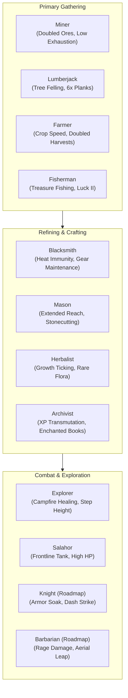

# Origins Rustic — Gameplay Design, Server Meta & Economy (`Business.md`)

This document specifies the high-level gameplay design, server meta, player progression, and economic mechanics of **Origins Rustic** in the **Rustic Craft 2 (`RC2`)** modpack.

---

## 1. Core Philosophy & Design Intent

Rustic Craft 2 is a medieval-fantasy, roleplay-centric survival experience. The primary design intent of **Origins Rustic** is to create **meaningful interdependence** between players without creating inescapable game-breaking disadvantages.

### Key Pillars:
1. **Biological Identity vs. Vocational Skill**:
   * **Race (Origin)** determines innate physiology (where you can live, what you can eat, environmental threats).
   * **Class (Job)** determines economic function and specialized craftsmanship (what you produce, which tools you can wield).
2. **Economic Interdependence & Tool Exclusivity**:
   * No single player can master every trade.
   * Tool gating ensures that butchers are required for animal processing (`butchery:iron_cleaver`), farmers are required for rapid industrial irrigation (`hearthandharvest:watering_can`), and blacksmiths are required for efficient armor/weapon restoration.
3. **Dynamic Ecosystem Integration**:
   * Every race has distinct environmental niches:
     * *Amphibians* dominate oceans, rivers, and underwater structures.
     * *Dwarves* dominate the deep subterranean layers ($Y \le 60$).
     * *Sylvans* dominate dense old-growth forests.
     * *Undead* and *Phantoms* dominate the night and dark ruins.

---

## 2. Player Roles & Economy Matrix

---

## 3. Combat Meta & Weapon Restrictions

To preserve medieval aesthetic and combat variety, weapons are classified via item tags:
* `#rustic:light_weapons`: Rapiers, daggers, shortswords, and arming swords intended for fast skirmishers (e.g. Rogue, Explorer, Arachnid).
* `#rustic:heavy_weapons`: Zweihanders, halberds, poleaxes, and greatswords from *Magistu Armory*. High damage and reach, but trigger exhaustion penalties and mobility restrictions for agile origins (e.g. Dragonborn flight restriction).
* `#rustic:banned_items`: Overpowered modern or high-fantasy equipment that circumvents the medieval combat pacing (Netherite armor, overpowered modded katanas).

---

## 4. Balancing & Failure Modes

* **Soft Locks Prevention**: Classes with tool restrictions are given actionbar error feedback when attempting unauthorized item usage rather than crash or inventory deletion.
* **Environmental Vulnerability Mitigation**:
  * *Undead* can survive daytime by wearing any helmet or staying in shadowed blocks.
  * *Amphibians* can mitigate dry slowness by carrying water buckets or staying near rain/rivers.
  * *Enderians* must construct sheltered bridges or drink fire resistance / moisture barriers when crossing water bodies.
